# Enterprise Secure Network Infrastructure using Cisco Packet Tracer

## Project Overview

This project simulates a secure enterprise-grade network infrastructure using Cisco Packet Tracer.
The topology demonstrates practical enterprise networking concepts including:

* VLAN segmentation
* Inter-VLAN routing
* Router-on-a-Stick
* DHCP automation
* Wireless networking
* SSH remote management
* ACL security
* STP redundancy
* Syslog monitoring
* Management VLAN implementation
* Enterprise switch redundancy

This project was built to strengthen hands-on networking and security skills for internships in:

* Network Engineering
* Network Security
* NOC Operations
* System Administration
* Infrastructure Support

---

# Full Enterprise Topology

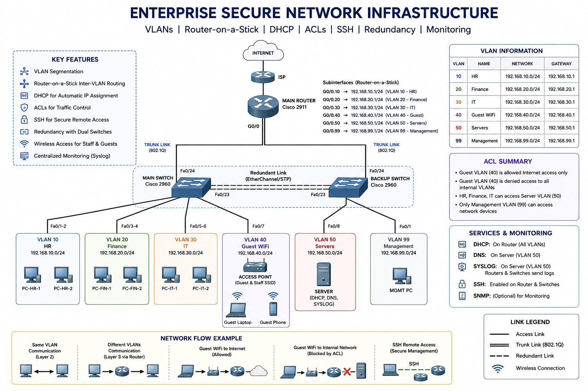

---

# Enterprise Network Architecture

The network consists of:

| Device            | Purpose                   |
| ----------------- | ------------------------- |
| Cisco 2911 Router | Inter-VLAN Routing + DHCP |
| Main Switch       | Primary Layer 2 Switching |
| Backup Switch     | Redundancy + Failover     |
| Access Point      | Wireless Connectivity     |
| Server            | Syslog Monitoring         |
| Management PC     | SSH Administration        |
| Department PCs    | End Users                 |

---

# VLAN Design

| VLAN | Name       | Network         | Gateway      |
| ---- | ---------- | --------------- | ------------ |
| 10   | HR         | 192.168.10.0/24 | 192.168.10.1 |
| 20   | FINANCE    | 192.168.20.0/24 | 192.168.20.1 |
| 30   | IT         | 192.168.30.0/24 | 192.168.30.1 |
| 40   | GUEST/WIFI | 192.168.40.0/24 | 192.168.40.1 |
| 50   | SERVERS    | 192.168.50.0/24 | 192.168.50.1 |
| 99   | MANAGEMENT | 192.168.99.0/24 | 192.168.99.1 |

---

# Physical Connections

## Router Connections

| Router Port | Connected Device | Device Port |
| ----------- | ---------------- | ----------- |
| G0/0        | Main Switch      | Fa0/24      |
| G0/1        | Backup Switch    | Fa0/24      |

---

## Redundant Switch Links

| Main Switch | Backup Switch |
| ----------- | ------------- |
| Fa0/22      | Fa0/22        |
| Fa0/23      | Fa0/23        |

---

## Main Switch Connections

| Port    | Device       | VLAN    |
| ------- | ------------ | ------- |
| Fa0/1-2 | HR PCs       | VLAN 10 |
| Fa0/3-4 | Finance PCs  | VLAN 20 |
| Fa0/5-6 | IT PCs       | VLAN 30 |
| Fa0/7   | Access Point | VLAN 40 |
| Fa0/24  | Router       | Trunk   |

---

## Backup Switch Connections

| Port   | Device        | VLAN    |
| ------ | ------------- | ------- |
| Fa0/1  | Syslog Server | VLAN 50 |
| Fa0/2  | Management PC | VLAN 99 |
| Fa0/24 | Router        | Trunk   |

---

# Enterprise Features Implemented

| Technology        | Purpose                  |
| ----------------- | ------------------------ |
| VLANs             | Department segmentation  |
| Trunking          | VLAN transport           |
| Router-on-a-Stick | Inter-VLAN routing       |
| DHCP              | Automatic IP assignment  |
| SSH               | Secure remote management |
| ACLs              | Traffic filtering        |
| STP               | Loop prevention          |
| Redundancy        | High availability        |
| Syslog            | Centralized monitoring   |
| Wireless          | Enterprise WiFi          |

---

# Main Switch Configuration

The Main Switch acts as the primary Layer 2 switching device.

---

## Basic Configuration

```bash
enable
configure terminal

hostname MainSwitch
no ip domain-lookup
```

### What this does

* Sets switch hostname
* Disables DNS lookup delays

---

## VLAN Configuration

```bash
vlan 10
name HR

vlan 20
name FINANCE

vlan 30
name IT

vlan 40
name GUEST

vlan 50
name SERVERS

vlan 99
name MANAGEMENT
```

### What this does

Creates VLANs for departmental segmentation.

---

## Access Port Configuration

### HR Department

```bash
interface range fa0/1-2
switchport mode access
switchport access vlan 10
```

### Finance Department

```bash
interface range fa0/3-4
switchport mode access
switchport access vlan 20
```

### IT Department

```bash
interface range fa0/5-6
switchport mode access
switchport access vlan 30
```

### Wireless Access Point

```bash
interface fa0/7
switchport mode access
switchport access vlan 40
```

### What this does

Assigns devices into appropriate VLANs.

---

## Trunk Configuration

```bash
interface fa0/24
switchport mode trunk

interface range fa0/22-23
switchport mode trunk
```

### What this does

Allows multiple VLANs to travel between:

* router,
* switches,
* redundant links.

---

## Port Security

```bash
interface range fa0/1-7
switchport port-security
switchport port-security maximum 2
switchport port-security violation shutdown
```

### What this does

Protects against unauthorized devices.

---

## STP Root Bridge Configuration

```bash
spanning-tree mode pvst
spanning-tree vlan 1,10,20,30,40,50,99 priority 4096
```

### What this does

Makes Main Switch the STP root bridge.

---

## Management VLAN Configuration

```bash
interface vlan 99
ip address 192.168.99.2 255.255.255.0
no shutdown

ip default-gateway 192.168.99.1
```

### What this does

Allows remote SSH management of the switch.

---

# Backup Switch Configuration

The Backup Switch provides enterprise redundancy and failover support.

---

## Basic Configuration

```bash
enable
configure terminal

hostname BackupSwitch
no ip domain-lookup
```

---

## VLAN Configuration

```bash
vlan 10
name HR

vlan 20
name FINANCE

vlan 30
name IT

vlan 40
name GUEST

vlan 50
name SERVERS

vlan 99
name MANAGEMENT
```

---

## Trunk Configuration

```bash
interface fa0/24
switchport mode trunk

interface range fa0/22-23
switchport mode trunk
```

---

## STP Secondary Root Bridge

```bash
spanning-tree mode pvst
spanning-tree vlan 1,10,20,30,40,50,99 priority 8192
```

### What this does

Makes Backup Switch the secondary STP root bridge.

---

## Server Port Configuration

```bash
interface fa0/1
switchport mode access
switchport access vlan 50
```

---

## Management PC Port

```bash
interface fa0/2
switchport mode access
switchport access vlan 99
```

---

## Management VLAN IP

```bash
interface vlan 99
ip address 192.168.99.3 255.255.255.0
no shutdown

ip default-gateway 192.168.99.1
```

---

# Router Configuration

The router performs:

* Inter-VLAN routing
* DHCP
* ACL filtering

using Router-on-a-Stick architecture.

---

## Basic Configuration

```bash
enable
configure terminal

hostname MainRouter
no ip domain-lookup
```

---

## Activate Interfaces

```bash
interface g0/0
no shutdown

interface g0/1
no shutdown
```

---

# Router-on-a-Stick Configuration

## VLAN 10

```bash
interface g0/0.10
encapsulation dot1Q 10
ip address 192.168.10.1 255.255.255.0
```

---

## VLAN 20

```bash
interface g0/0.20
encapsulation dot1Q 20
ip address 192.168.20.1 255.255.255.0
```

---

## VLAN 30

```bash
interface g0/0.30
encapsulation dot1Q 30
ip address 192.168.30.1 255.255.255.0
```

---

## VLAN 40

```bash
interface g0/0.40
encapsulation dot1Q 40
ip address 192.168.40.1 255.255.255.0
```

---

## VLAN 50

```bash
interface g0/0.50
encapsulation dot1Q 50
ip address 192.168.50.1 255.255.255.0
```

---

## VLAN 99

```bash
interface g0/0.99
encapsulation dot1Q 99
ip address 192.168.99.1 255.255.255.0
```

### What this does

Creates VLAN gateways for all VLANs.

---

# DHCP Configuration

The router automatically assigns IP addresses to clients.

---

## Excluded Addresses

```bash
ip dhcp excluded-address 192.168.99.1 192.168.99.20
```

### What this does

Prevents infrastructure IP conflicts.

---

## HR DHCP Pool

```bash
ip dhcp pool HR
network 192.168.10.0 255.255.255.0
default-router 192.168.10.1
dns-server 8.8.8.8
```

---

## FINANCE DHCP Pool

```bash
ip dhcp pool FINANCE
network 192.168.20.0 255.255.255.0
default-router 192.168.20.1
dns-server 8.8.8.8
```

---

## IT DHCP Pool

```bash
ip dhcp pool IT
network 192.168.30.0 255.255.255.0
default-router 192.168.30.1
dns-server 8.8.8.8
```

---

## GUEST DHCP Pool

```bash
ip dhcp pool GUEST
network 192.168.40.0 255.255.255.0
default-router 192.168.40.1
dns-server 8.8.8.8
```

---

## MANAGEMENT DHCP Pool

```bash
ip dhcp pool MANAGEMENT
network 192.168.99.0 255.255.255.0
default-router 192.168.99.1
dns-server 8.8.8.8
```

---

# ACL Security Configuration

Guest wireless users are restricted from accessing internal VLANs.

---

## ACL Creation

```bash
access-list 100 deny ip 192.168.40.0 0.0.0.255 192.168.0.0 0.0.255.255
access-list 100 permit ip any any
```

---

## Apply ACL

```bash
interface g0/0.40
ip access-group 100 in
```

### What this does

Blocks guest users from internal enterprise resources.

---

# SSH Remote Access Configuration

SSH allows secure remote management.

---

## Configure SSH

```bash
hostname MainRouter
ip domain-name enterprise.local

crypto key generate rsa

username admin secret Cisco123

line vty 0 4
login local
transport input ssh
```

### What this does

Enables encrypted remote administration.

---

# Wireless Network Configuration

The Access Point provides wireless connectivity.

| Setting  | Value       |
| -------- | ----------- |
| SSID     | CompanyWiFi |
| VLAN     | 40          |
| Security | WPA2-PSK    |
| Password | Cisco123    |

---

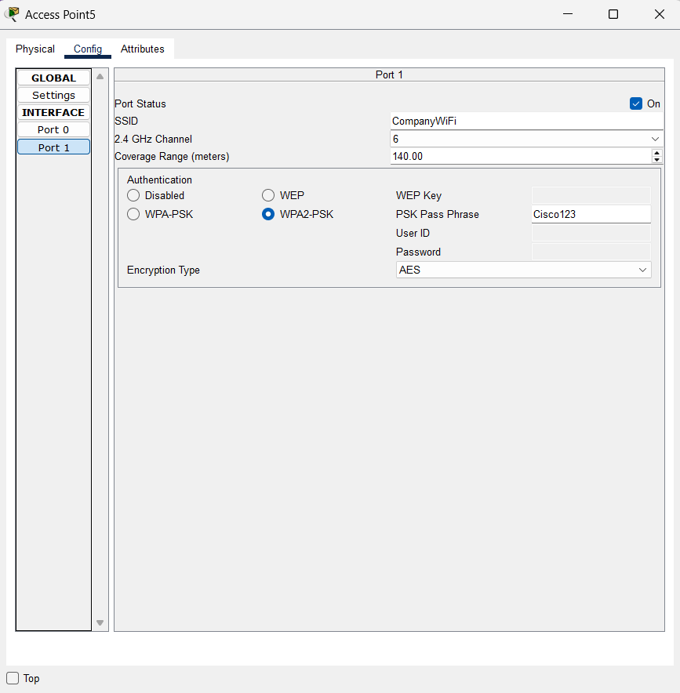

# Syslog Server Configuration

The server collects network logs from infrastructure devices.

---

## Server Network Settings

| Setting     | Value         |
| ----------- | ------------- |
| IP Address  | 192.168.50.2  |
| Subnet Mask | 255.255.255.0 |
| Gateway     | 192.168.50.1  |

---

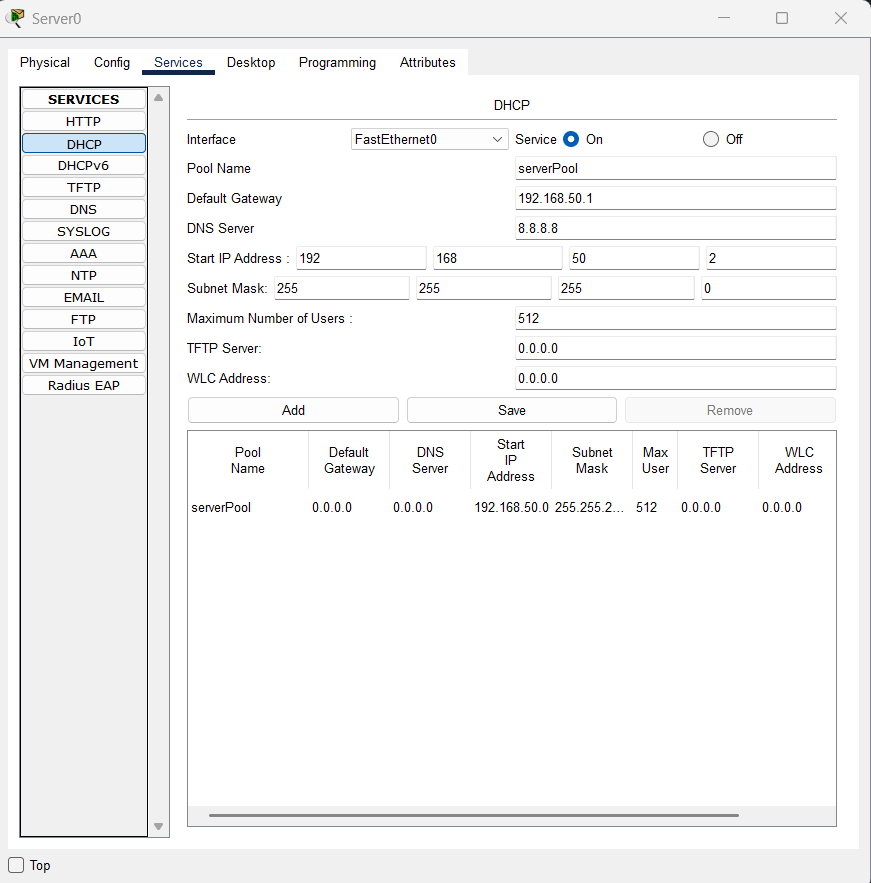


## Enable SYSLOG Service

Go:

```text
Server → Services → SYSLOG
```

Turn:

```text
ON
```

---

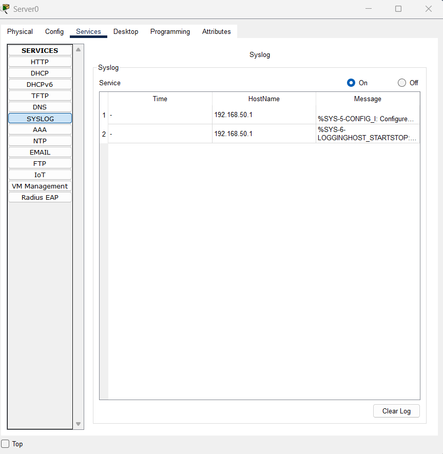

## Router Logging Configuration

```bash
logging 192.168.50.2
```

### What this does

Sends router logs to centralized Syslog server.

---

# Management VLAN

VLAN 99 is dedicated for:

* SSH management,
* switch administration,
* infrastructure management traffic.

Only management devices belong to this VLAN.

---

# Verification Commands

## Switch Verification

```bash
show vlan brief
show interfaces trunk
show spanning-tree
show port-security
```

---

## Router Verification

```bash
show ip interface brief
show ip dhcp binding
show access-lists
show ip route
```

---

# Connectivity Tests Performed

| Test                     | Result     |
| ------------------------ | ---------- |
| Inter-VLAN Communication | Successful |
| DHCP Assignment          | Successful |
| Wireless Connectivity    | Successful |
| SSH Access               | Successful |
| ACL Filtering            | Successful |
| STP Failover             | Successful |
| Syslog Monitoring        | Successful |

---

# Screenshots

## Enterprise Topology

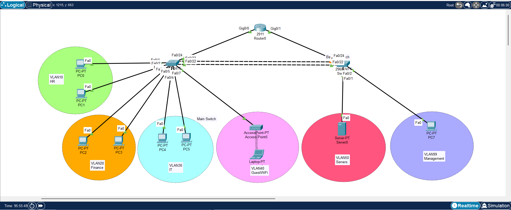

---

## VLAN Configuration

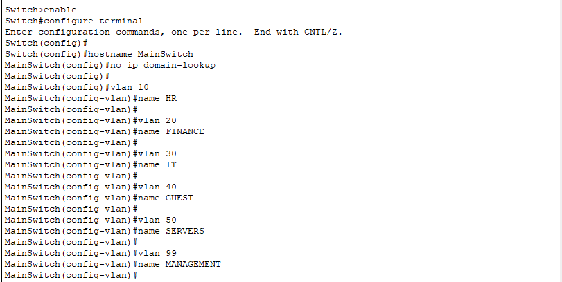
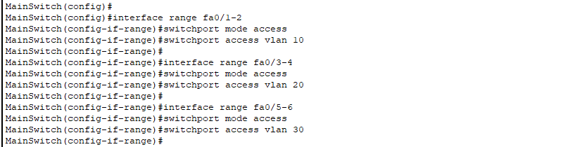
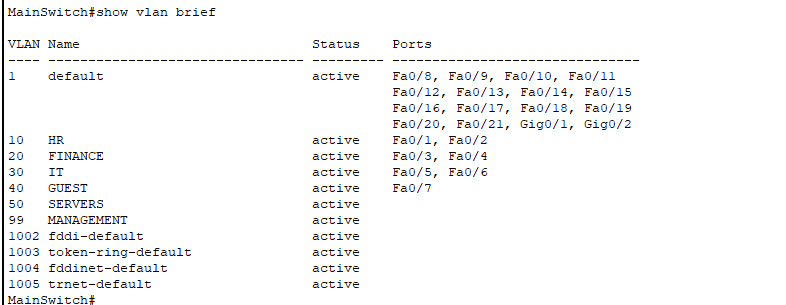

---

## Trunk Configuration

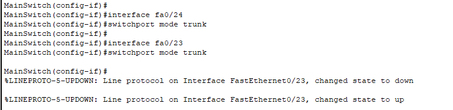

---

## STP Status

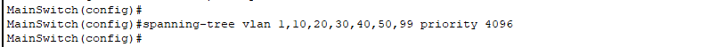

---

## DHCP Bindings

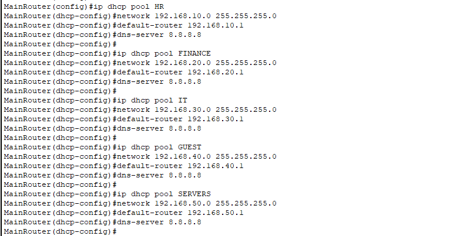

---

## SSH Login

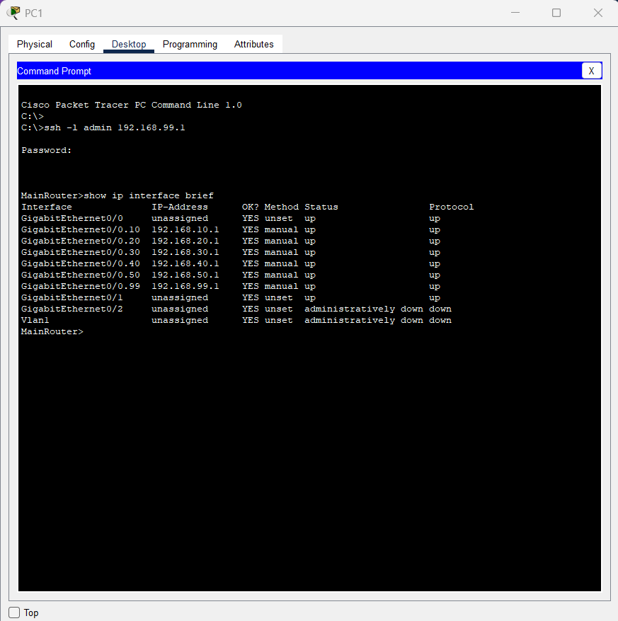

---

## ACL Configuration

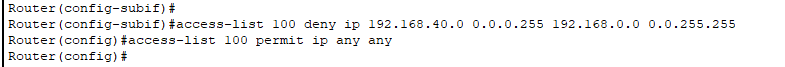

---

## Syslog Monitoring


---

## Wireless Connectivity

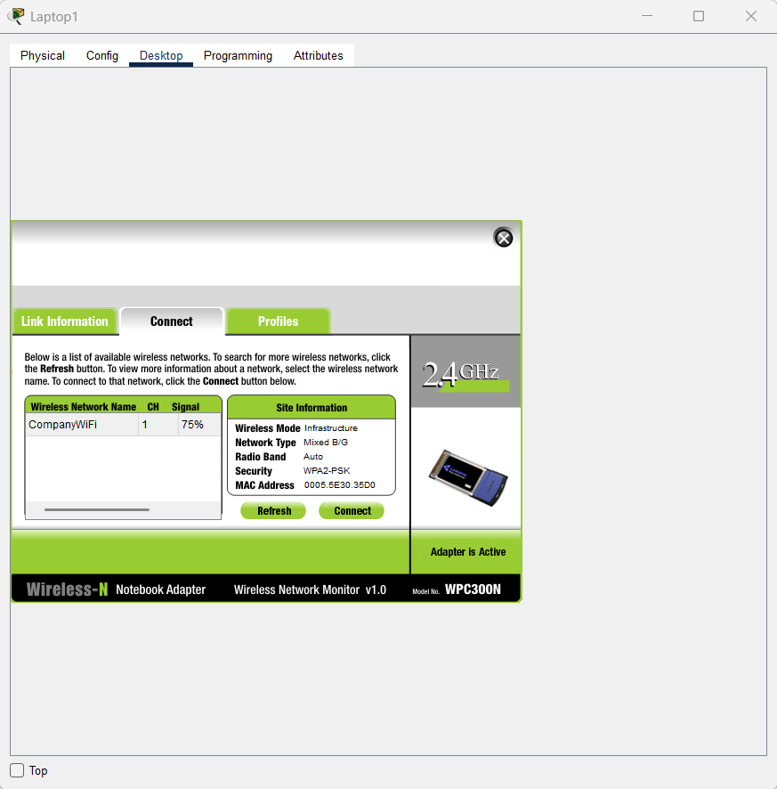
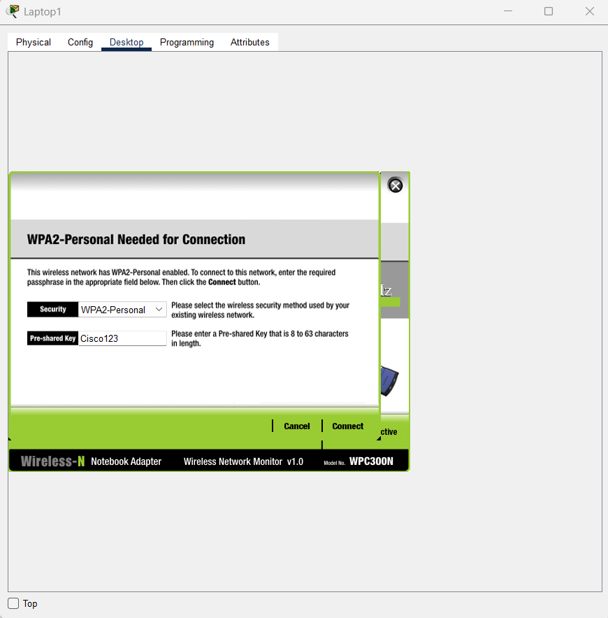
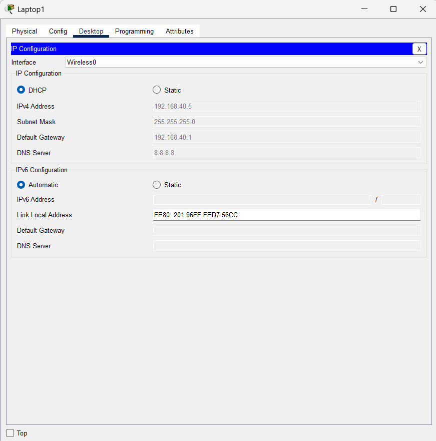

---

# Skills Demonstrated

## Networking

* VLAN Design
* Inter-VLAN Routing
* Trunking
* DHCP
* STP
* Wireless Networking

## Security

* ACL Security
* SSH
* Port Security
* Network Segmentation

## Enterprise Infrastructure

* Redundancy
* High Availability
* Monitoring
* Infrastructure Documentation

---

# Future Improvements

Possible future enhancements:

* HSRP
* EtherChannel
* OSPF Routing
* Firewall Integration
* VPN Connectivity
* SNMP Monitoring
* AAA Authentication
* Linux Syslog Server

---

# Project Structure

```text
enterprise-secure-network/
│
├── README.md
├── enterprise-network.pkt
│
├── screenshots/
│   ├── topology.png
│   ├── main-switch-vlans1.png
│   ├── main-switch-vlans2.png
│   ├── main-switch-vlans3.png
│   ├── main-switch-trunks.png
│   ├── main-switch-stp.png
│   ├── dhcp-bindings.png
│   ├── diagram.png
│   ├── ssh-login.png
│   ├── acl-config.png
│   ├── wireless-connected1.png
│   ├── wireless-connected2.png
│   ├── wireless-connected3.png
│   ├── AccessPoint.png
│   └── syslog-monitoring.png
│
├── configs/
│   ├── router-config.txt
│   ├── main-switch-config.txt
│   ├── backup-switch-config.txt
│   └── acl-config.txt
│
└── diagrams/
    └── diagram.png
```

---

# How to Run

1. Open `enterprise-network.pkt`
2. Wait for devices to initialize
3. Verify VLANs
4. Test DHCP
5. Verify wireless connectivity
6. Test SSH login
7. Test ACL restrictions
8. Verify Syslog monitoring
9. Test STP failover

---

# Author

Chamikara Jayasinghe

* ICT Undergraduate
* Network and Security Technologies Specialization
* Cisco CCNA Certified

---

# License

This project is created for educational and portfolio purposes.
